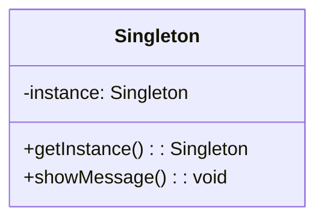
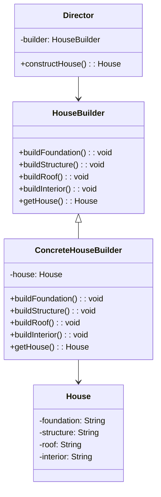
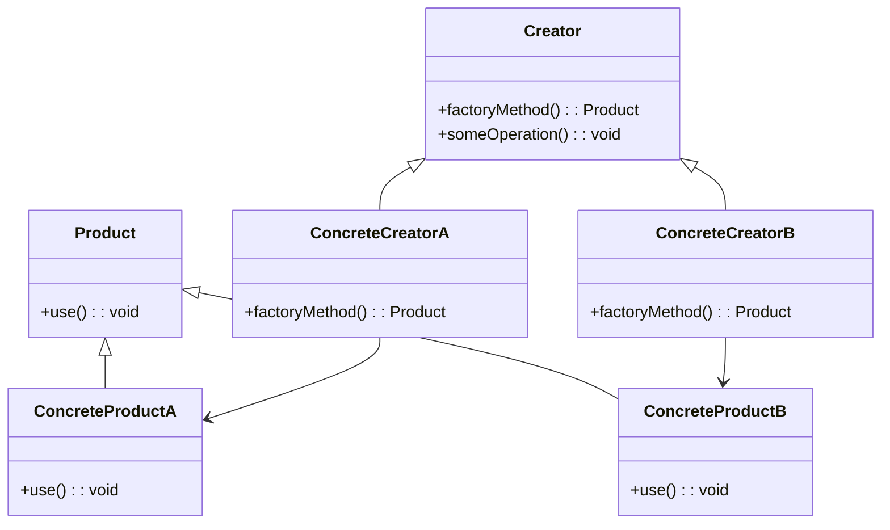
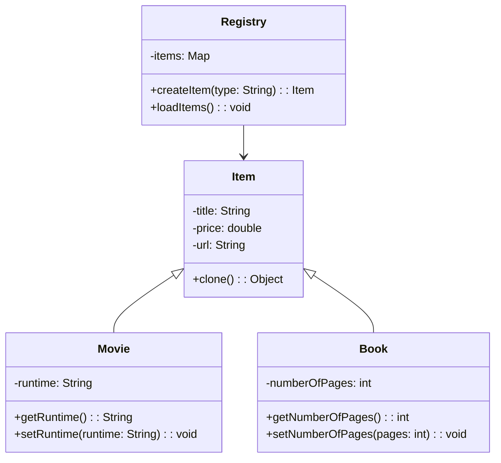
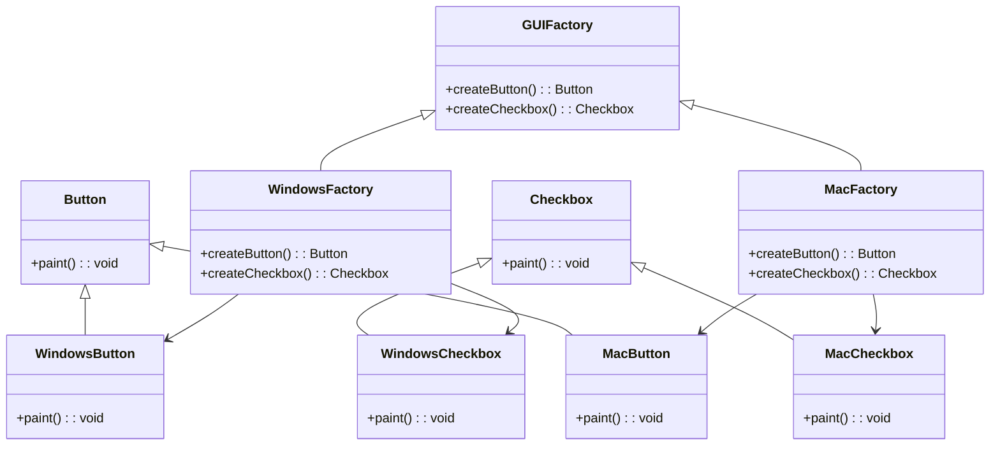

# Creational Design Patterns

## Singleton Pattern

The Singleton Pattern ensures that a class has only one instance and provides a global point of access to that instance.
This is useful when exactly one object is needed to coordinate actions across the system.

### Example

```java
public class Singleton {
    private static Singleton instance;

    private Singleton() {}

    public static Singleton getInstance() {
        if (instance == null) {
            instance = new Singleton();
        }
        return instance;
    }

    public void showMessage() {
        System.out.println("Hello from Singleton!");
    }
}
// Usage
public class Main {
    public static void main(String[] args) {
        Singleton singleton = Singleton.getInstance();
        singleton.showMessage();
    }
}
```
## Builder Pattern

The Builder Pattern is used to construct a complex object step by step.
It separates the construction of a complex object from its representation,
allowing the same construction process to create different representations.

### Example

```java
// Product class
public class House {
    private String foundation;
    private String structure;
    private String roof;
    private String interior;

    public void setFoundation(String foundation) { this.foundation = foundation; }
    public void setStructure(String structure) { this.structure = structure; }
    public void setRoof(String roof) { this.roof = roof; }
    public void setInterior(String interior) { this.interior = interior; }

    @Override
    public String toString() {
        return "House [foundation=" + foundation + ", structure=" + structure + ", roof=" + roof + ", interior=" + interior + "]";
    }
}

// Builder interface
public interface HouseBuilder {
    void buildFoundation();
    void buildStructure();
    void buildRoof();
    void buildInterior();
    House getHouse();
}

// Concrete Builder
public class ConcreteHouseBuilder implements HouseBuilder {
    private House house;

    public ConcreteHouseBuilder() {
        this.house = new House();
    }

    @Override
    public void buildFoundation() {
        house.setFoundation("Concrete Foundation");
    }

    @Override
    public void buildStructure() {
        house.setStructure("Concrete Structure");
    }

    @Override
    public void buildRoof() {
        house.setRoof("Concrete Roof");
    }

    @Override
    public void buildInterior() {
        house.setInterior("Modern Interior");
    }

    @Override
    public House getHouse() {
        return this.house;
    }
}

// Director
public class Director {
    private HouseBuilder houseBuilder;

    public Director(HouseBuilder houseBuilder) {
        this.houseBuilder = houseBuilder;
    }

    public House constructHouse() {
        houseBuilder.buildFoundation();
        houseBuilder.buildStructure();
        houseBuilder.buildRoof();
        houseBuilder.buildInterior();
        return houseBuilder.getHouse();
    }
}
//Usage
public class Main {
    public static void main(String[] args) {
        HouseBuilder builder = new ConcreteHouseBuilder();
        Director director = new Director(builder);
        House house = director.constructHouse();
        System.out.println(house);
    }
}
```
## Factory Method Pattern
The Factory Method Pattern provides an interface for creating objects in a superclass
but allows subclasses to alter the type of objects that will be created.

### Example

```java
// Abstract Product
public interface Product {
    void use();
}

// Concrete Products
public class ConcreteProductA implements Product {
    @Override
    public void use() {
        System.out.println("Using ConcreteProductA");
    }
}

public class ConcreteProductB implements Product {
    @Override
    public void use() {
        System.out.println("Using ConcreteProductB");
    }
}

// Creator (Abstract Factory)
public abstract class Creator {
    public abstract Product factoryMethod();

    public void someOperation() {
        Product product = factoryMethod();
        product.use();
    }
}

// Concrete Creators
public class ConcreteCreatorA extends Creator {
    @Override
    public Product factoryMethod() {
        return new ConcreteProductA();
    }
}

public class ConcreteCreatorB extends Creator {
    @Override
    public Product factoryMethod() {
        return new ConcreteProductB();
    }
}

// Usage
public class Main {
    public static void main(String[] args) {
        Creator creatorA = new ConcreteCreatorA();
        creatorA.someOperation(); // Output: Using ConcreteProductA

        Creator creatorB = new ConcreteCreatorB();
        creatorB.someOperation(); // Output: Using ConcreteProductB
    }
}
```

## Prototype Pattern
The Prototype Pattern is a creational design pattern that allows you to create new objects by copying existing objects,
known as prototypes.

### Example

```java
public abstract class Item implements Cloneable {
    private String title;
    private double price;
    private String url;

    @Override
    protected Object clone() throws CloneNotSupportedException {
        return super.clone();
    }
}

public class Movie extends Item {
    private String runtime;

    public String getRuntime() {
        return runtime;
    }

    public void setRuntime(String runtime) {
        this.runtime = runtime;
    }
}

public class Book extends Item {
    private int numberOfPages;

    public int getNumberOfPages() {
        return numberOfPages;
    }

    public void setNumberOfPages(int numberOfPages) {
        this.numberOfPages = numberOfPages;
    }
}

public class Registry {
    private Map<String, Item> items = new HashMap<>();

    public Registry() {
        loadItems();
    }

    public Item createItem(String type) {
        Item item = null;
        try {
            item = (Item) items.get(type).clone();
        } catch (CloneNotSupportedException e) {
            throw new RuntimeException(e);
        }
        return item;
    }

    private void loadItems() {
        Movie movie = new Movie();
        movie.setTitle("Basic Movie");
        movie.setPrice(10.0);
        movie.setRuntime("2 hours");
        items.put("Movie", movie);

        Book book = new Book();
        book.setNumberOfPages(335);
        book.setPrice(19.99);
        book.setTitle("Harry Potter and the Philosopher's Stone");
        items.put("Book", book);
    }
}

//Usage
public class Main {
    public static void main(String[] args) {
        Registry registry = new Registry();
        Item clonedMovie = registry.createItem("Movie");
        Item clonedBook = registry.createItem("Book");
    }
}
```

## Abstract Factory Pattern
The Abstract Factory Pattern provides an interface for creating families of related or dependent objects without specifying their concrete classes.

```java
// Abstract Products
public interface Button {
    void paint();
}

public interface Checkbox {
    void paint();
}

// Concrete Products
public class WindowsButton implements Button {
    @Override
    public void paint() {
        System.out.println("Rendering a button in a Windows style.");
    }
}

public class MacButton implements Button {
    @Override
    public void paint() {
        System.out.println("Rendering a button in a Mac style.");
    }
}

public class WindowsCheckbox implements Checkbox {
    @Override
    public void paint() {
        System.out.println("Rendering a checkbox in a Windows style.");
    }
}

public class MacCheckbox implements Checkbox {
    @Override
    public void paint() {
        System.out.println("Rendering a checkbox in a Mac style.");
    }
}

// Abstract Factory
public interface GUIFactory {
    Button createButton();
    Checkbox createCheckbox();
}

// Concrete Factories
public class WindowsFactory implements GUIFactory {
    @Override
    public Button createButton() {
        return new WindowsButton();
    }

    @Override
    public Checkbox createCheckbox() {
        return new WindowsCheckbox();
    }
}

public class MacFactory implements GUIFactory {
    @Override
    public Button createButton() {
        return new MacButton();
    }

    @Override
    public Checkbox createCheckbox() {
        return new MacCheckbox();
    }
}

// Client
public class Application {
    private Button button;
    private Checkbox checkbox;

    public Application(GUIFactory factory) {
        button = factory.createButton();
        checkbox = factory.createCheckbox();
    }

    public void paint() {
        button.paint();
        checkbox.paint();
    }
}

//Usage
public class Main {
    private static Application configureApplication() {
        Application app;
        GUIFactory factory;
        String osName = System.getProperty("os.name").toLowerCase();
        if (osName.contains("win")) {
            factory = new WindowsFactory();
        } else {
            factory = new MacFactory();
        }
        app = new Application(factory);
        return app;
    }

    public static void main(String[] args) {
        Application app = configureApplication();
        app.paint();
    }
}
```


### Diagrams of each Design type Creational Pattern

### Singleton Pattern

### Builder Pattern


### Factory Method Patter

### Prototype Pattern

### Abstract Factory Pattern



## Summary

-**Singleton Pattern**: Ensures a class has only one instance and provides a global point of access to it.

-**Builder Pattern**: Separates the construction of a complex object from its representation.

-**Factory Method Pattern**: Provides an interface for creating objects in a superclass but allows subclasses to 
alter the type of objects that will be created.

-**Prototype Pattern**: Allows you to create new objects by copying existing objects, known as prototypes.

-**Abstract Factory Pattern**: Provides an interface for creating families of related or dependent objects without 
specifying their concrete classes.